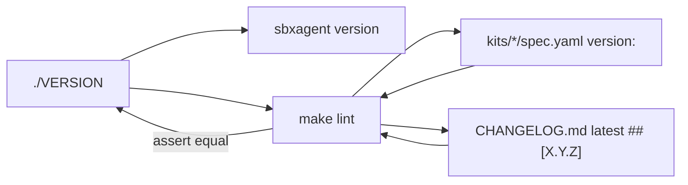

# Unified repo version via `./VERSION`

## Goal

One visible canonical version at the repo root. Kit specs still carry `version:` (Sandbox Kit schema requirement for `sbx kit pack` / publishing), but humans and the wrapper CLI read `./VERSION`. `make lint` enforces that nothing drifts.



## Current state

- All three kits already at `version: "0.2.0"` in `kits/sbxclaude/spec.yaml`
- `CHANGELOG.md` latest release is `## [0.2.0] - 2026-09-01`
- `Makefile` lint loops `kits/*/spec.yaml` and compares each to the changelog (no `VERSION` file yet)
- `scripts/sbxagent` `version` subcommand greps `kits/*/spec.yaml` (lines 141–146)

## Changes

### 1. Add `VERSION`

Single line, no prefix:

```
0.2.0
```

Tracked in git. No trailing spaces; one newline at end of file.

### 2. Update `Makefile` `lint`

Replace the version block (lines 45–57) with a **triple lockstep** check:

1. **Read `VERSION`** — fail if missing or if it does not contain exactly one `X.Y.Z` match on the first line (use the same `grep -oE '[0-9]+\.[0-9]+\.[0-9]+'` pattern already used for specs; reject empty or multi-match).
2. **Read changelog** — keep existing logic: first `## [X.Y.Z]` heading in `CHANGELOG.md`.
3. **Compare** — `VERSION` must equal changelog latest release.
4. **Loop `kits/*/spec.yaml`** — each `version:` must equal `VERSION` (same grep as today).

Update the `lint` comment header (lines 14–15) to mention `VERSION` as the canonical source.

Example error messages:

- `lint: VERSION is 0.2.0 but CHANGELOG.md's latest release is 0.1.0`
- `lint: kits/sbxcodex/spec.yaml is version 0.1.0 but VERSION is 0.2.0`

### 3. Update `scripts/sbxagent` `version` subcommand

`REPO` is already resolved at line 83. Change the `version)` branch to read `${REPO}/VERSION` instead of `${KIT}/spec.yaml`:

```bash
kit_version="$(grep -m1 -oE '[0-9]+\.[0-9]+\.[0-9]+' "${REPO}/VERSION")"
[[ -n "${kit_version}" ]] || die "could not read version from ${REPO}/VERSION"
```

Keep printing `KIT_NAME` + version (unchanged user-facing format: `sbxclaude 0.2.0`).

### 4. Update `tests/sbxagent_test.sh`

- Revise the comment at line 186 (`reads spec.yaml` → reads `VERSION`).
- Optionally tighten assertions from regex to exact `sbxclaude 0.2.0` / `sbxcodex 0.2.0` / `sbxcursor 0.2.0` by reading `VERSION` in the test (`ROOT/VERSION`) — keeps tests aligned with the file without hardcoding. Regex is still acceptable if you prefer less coupling.

### 5. Update docs (release instructions only)

**`AGENTS.md`** — Changelog section (lines 75–80):

- On release, bump **`VERSION`** and **every** `kits/*/spec.yaml` `version:` to match the new `## [X.Y.Z]` heading.
- Tag `vX.Y.Z` when `VERSION`, all specs, and `CHANGELOG.md` agree (`make lint` enforces this).

**`README.md`** — Pinned toolchain section (lines 156–159):

- State that repo version lives in `VERSION`; `make lint` fails if it disagrees with any kit `version:` or `CHANGELOG.md`'s latest release.

No `CHANGELOG.md` entry — internal release-process change, skipped per AGENTS.md.

## Release workflow (manual, no new scripts)

For future releases, one commit updates **three places** by hand:

1. `VERSION`
2. `version:` in all `kits/*/spec.yaml`
3. `CHANGELOG.md` — move `[Unreleased]` entries to `## [X.Y.Z] - date`

Then `make lint`, tag `vX.Y.Z`. No `make release` target.

## Verification

```bash
make lint
make test-unit
```

`make validate` not required (no spec schema changes beyond adding `VERSION` file outside kits).

## Out of scope (explicit)

- `make release` or any new bump script
- Changing kit spec `version:` to be generated or removed (schema still requires it)
- GitHub Release / kit publish automation
- Bumping away from `0.2.0` (stay at current version)
