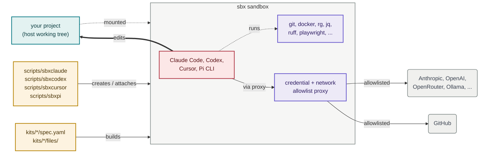

# sbxagent

[](https://github.com/lars20070/sbxagent/actions/workflows/ci.yml)
[](https://deepwiki.com/lars20070/sbxagent)
[](LICENSE)

`sbxagent` runs a coding agent in an isolated sandbox, with a fixed toolchain
already installed. Think of it as a customized version of
[`sbx run claude`](https://docs.docker.com/ai/sandboxes/agents/claude-code/), [`sbx run codex`](https://docs.docker.com/ai/sandboxes/agents/codex/) and [`sbx run cursor`](https://docs.docker.com/ai/sandboxes/agents/cursor/),
plus [Pi](https://pi.dev), which `sbx` ships no agent for at all.

One script serves four commands — `sbxclaude`, `sbxcodex`, `sbxcursor` and
`sbxpi` — by dispatching on the name it was invoked as. Each gets its own
sandbox and its own credentials, so all four can run against the same project
at once.

## How it works



<br>*The wrapper (amber) builds the sandbox from the matching kit spec and attaches to it. Inside, the agent (pink) uses the pinned toolchain (lavender) and talks out only through the credential and network-allowlist proxy, which lets through the agent's own LLM API and GitHub (grey) and blocks everything else. Your project (teal) is mounted straight into the sandbox and edited in place.*

## Supported agents

| Command | Agent | Parent kit | Entrypoint | Instruction file | MCP config | Network-block guard |
| --- | --- | --- | --- | --- | --- | --- |
| `sbxclaude` | Claude Code | `claude` | `claude` | `CLAUDE.md` | `~/.claude.json` | **yes** |
| `sbxcodex` | Codex | `codex` | `codex` | `AGENTS.md` | `~/.codex/config.toml` | yes (soft) |
| `sbxcursor` | Cursor | `cursor` | `agent` | `AGENTS.md` | `~/.cursor/mcp.json` | no |
| `sbxpi` | Pi | *none* | `pi` | `AGENTS.md` | *none* | yes (overridable) |

`sbxpi` is the odd one out twice over. It has **no parent kit** — `sbx` ships
no Pi agent, so the kit builds on the bare `shell-docker` template and installs
everything itself. And Pi has **no MCP support at all**, so there is no MCP
config to list; its model and provider settings live in
`~/.pi/agent/models.json` and `~/.pi/agent/settings.json` instead.

The **network-block guard is not equally strong in each sandbox**, because the
four CLIs offer different hook outputs:

- `sbxclaude` **ends the turn**. Claude Code treats the guard's `continue:
  false` as a hard stop, registered as managed-settings hook JSON.
- `sbxcodex` **cannot force a stop**. The same guard runs as a managed
  `PostToolUse` hook, but Codex's documented behaviour for every hook output —
  `continue: false` and `decision: "block"` alike — is to replace the tool
  result and let the model continue. So the agent sees the blocked host and a
  firm instruction to stop, and the user sees how to lift the block, but
  nothing prevents the agent from carrying on.
- `sbxcursor` has **no guard**. Its post-execution hooks are observation-only
  and cannot even inject feedback. Its instructions still ask for a blocked host
  to be reported, with nothing enforcing it.
- `sbxpi` **ends the run, one tool call later**. A Pi extension applies the same
  filter in two phases, because a Pi `tool_result` handler can patch a result
  but not stop a run: the blocked command's output is replaced with the remedy,
  and the agent's *next* tool call is then refused with `terminate`. The
  practical effect matches `sbxclaude`, one beat behind.

  Unlike the others, this binding is **overridable**. Pi has no
  managed-settings tier, so the guard is registered in
  `~/.pi/agent/settings.json`, which the agent can edit; and because the kit
  sets `defaultProjectTrust: "always"` so mounted projects load without a
  prompt, a project's own `.pi/settings.json` is trusted and can displace the
  `extensions` entry. The extension file itself is root-owned and outside
  `$HOME`, so it can be unregistered but not rewritten. That is the accepted
  cost of a smooth launch and honoured project config.

All three guards share one coverage gap: they match shell commands only, so a
block that surfaces solely in an MCP server's response — or, on `sbxpi`, in an
extension tool's response — is not caught.

`sbxcodex` is also the strictest sandbox in one respect: its admin-tier
`requirements.toml` sets `allow_managed_hooks_only`, so Codex ignores *all*
user, project, session and plugin hooks in there. That is deliberate — it stops
the guard being crowded out — but it is stricter than `sbxclaude`, which leaves
user hooks alone.

## What it does

Each sandbox gets:

- The agent itself, running with approvals bypassed inside the sandbox
- `jq`, `ripgrep`, `curl`, Python 3, and ShellCheck
- `ruff` and `yamllint` as Python development tools
- `markdownlint-cli2` and `cspell` for documentation checks
- Playwright, with headless Chromium, so the agent can load pages and
  screenshot UI changes itself
- mermaid-cli (`mmdc`), reusing that same Chromium, so the agent can render
  Mermaid diagrams to PNG/SVG from the terminal
- An `sbx` CLI for daemon-free kit commands (`version`, `kit validate`,
  `kit inspect`, `kit pack`) so `make validate` works inside the sandbox
- Passwordless `sudo`, and Docker, inside the sandbox
- A network allowlist, not open internet access
- `sbxclaude`, `sbxcodex` and `sbxpi`: a root-owned guard that catches a
  blocked request and prints the remedy that actually fits it — `sbx policy
  allow` for a default-deny, `sbx policy rm` for a local deny rule (deny beats
  allow, so allowing round it does nothing), or contact IT for an organisation
  policy the user cannot lift — ending the turn on `sbxclaude`, ending the run
  one tool call later on `sbxpi`, and advising the agent to stop on `sbxcodex`
- Your project mounted as the workspace — edits land on your real files
- GitHub SSH remotes rewritten to HTTPS inside the sandbox, so `git fetch`
  works on the allowlisted port 443 without changing the host checkout
- Context7 and GitHub MCP servers, so the agent can pull current library docs
  and use GitHub's MCP tools regardless of the project's own MCP configuration
  — except on `sbxpi`, where Pi supports no MCP at all: Context7 ships there as
  a native Pi package instead, and GitHub work goes through `git` and `gh`

Each kit spec lives in `kits/<command>/spec.yaml`, and `scripts/sbxagent` is a
wrapper around the `sbx` CLI that builds (or re-attaches to) one sandbox per
project, named `<command>-<project_directory>-<hash>`. The hash comes from the
canonical absolute path, so same-named directories do not share a sandbox, and
the command name is the prefix, so the four agents never collide.

Sandbox size follows the host: every host CPU, and half the host memory capped
at 32 GiB. To pin a fixed size instead, uncomment the `resources:` block in
that kit's `spec.yaml` and rebuild.

## Install

You need macOS 14 or later on Apple silicon, or Linux on x86_64 or aarch64 with
KVM available. Docker Desktop is not required. Install the `sbx` CLI, sign in,
and link `scripts/sbxagent` onto your `PATH` once per agent you want.

[macOS:](https://docs.docker.com/ai/sandboxes/install/#install-on-macos)

```bash
brew trust docker/tap
brew install docker/tap/sbx
sbx login
```

[Linux:](https://docs.docker.com/ai/sandboxes/install/#linux)

```bash
curl -fsSL https://get.docker.com | sudo REPO_ONLY=1 sh
sudo apt-get install docker-sbx
sudo usermod -aG kvm "$USER" && newgrp kvm
sbx login
```

Then, on either platform:

```bash
ln -s /path_to_sbxagent_repo/scripts/sbxagent ~/.local/bin/sbxclaude
ln -s /path_to_sbxagent_repo/scripts/sbxagent ~/.local/bin/sbxcodex
ln -s /path_to_sbxagent_repo/scripts/sbxagent ~/.local/bin/sbxcursor
ln -s /path_to_sbxagent_repo/scripts/sbxagent ~/.local/bin/sbxpi
```

Link only the agents you want; each is independent. `sbxagent` deliberately has
no default agent — run it under its own name and it refuses, rather than
silently picking one for you.

## Using a published kit

Every release publishes the four kits to GitHub Container Registry as OCI
artifacts, one package per kit, named after the command it corresponds to:

| Package | Equivalent to |
| --- | --- |
| `ghcr.io/lars20070/sbxclaude` | `sbxclaude` |
| `ghcr.io/lars20070/sbxcodex` | `sbxcodex` |
| `ghcr.io/lars20070/sbxcursor` | `sbxcursor` |
| `ghcr.io/lars20070/sbxpi` | `sbxpi` |

This is the way to use a kit **without cloning this repository**. You get the
kit — the toolchain, network policy, credentials and agent instructions — but
not the wrapper, so there is no per-project sandbox naming and no `sbx<agent>`
subcommands. Pass the reference to `sbx run` yourself. The kit's name is the
agent operand, exactly as the wrapper passes it:

```bash
sbx run --kit ghcr.io/lars20070/sbxclaude:0.4.0 sbxclaude
```

Each release publishes two tags: the version, which never moves, and `latest`,
re-pointed at the same digest. `latest` means "newest release" here rather than
"tip of main", because nothing publishes outside a release. Pin the version for
anything repeatable, or pin the digest to be certain:

```bash
sbx run --kit ghcr.io/lars20070/sbxclaude@sha256:<digest> sbxclaude
```

**If loading fails with a kit-source error rather than a registry error**, `sbx`
is refusing the source rather than failing to reach it. Kit sources are
allow-listed by prefix, so add this one:

```bash
sbx settings set kit.allowedSources '["docker.io/","ghcr.io/lars20070/"]'
```

Every artifact is signed keyless through GitHub Actions and carries a SLSA
provenance attestation. Both are worth checking before you run someone else's
kit:

```bash
sbx kit inspect     ghcr.io/lars20070/sbxclaude:0.4.0
sbx kit provenance  ghcr.io/lars20070/sbxclaude:0.4.0
sbx kit verify      ghcr.io/lars20070/sbxclaude:0.4.0 \
  --certificate-oidc-issuer https://token.actions.githubusercontent.com \
  --certificate-identity-regexp '^https://github.com/lars20070/sbxagent/'
```

The identity is what matters: it proves the artifact was built by this
repository's release workflow, not merely that someone signed it.

## Use

Run the command for the agent you want, from any project directory:

```bash
sbxclaude     # or sbxcodex, sbxcursor, or sbxpi
```

The first run builds a sandbox for that directory and attaches to it. Later
runs re-attach to the same sandbox, so your work carries over.

To enter the sandbox with a Bash shell:

```bash
sbxclaude exec bash
```

### Commands

All four commands take the same signatures. `sbx<agent>` below is any of
`sbxclaude`, `sbxcodex`, `sbxcursor` or `sbxpi`.

| Command | Effect |
| --- | --- |
| `sbx<agent>` | Attach; create the sandbox first if missing |
| `sbx<agent> create` | Build the sandbox without attaching |
| `sbx<agent> rm` | Remove the sandbox after confirmation |
| `sbx<agent> name` | Print the derived sandbox name |
| `sbx<agent> version` | Print the kit name and version |
| `sbx<agent> exec CMD...` | Run a command inside the sandbox |
| `sbx<agent> inspect` | Show the sandbox's state |
| `sbx<agent> policy log` | Show the sandbox policy log |
| `sbx<agent> policy check HOST` | Check sandbox network access to `HOST` |
| `sbx<agent> kit validate` | Check the kit against the current schema |
| `sbx<agent> help` | Show usage |

The wrapper accepts only these signatures. It does not forward prompts or agent
flags. Use `sbx` and the name directly for anything outside the table. For
example

```bash
S="$(sbxclaude name)"
sbx inspect "${S}"
```

### Rebuild after kit changes

Remove and re-create the sandbox to apply changes to the kit:

```bash
sbxclaude rm   # confirms (y/N)
sbxclaude      # recreates from the kit and attaches
```

Pin bumps in `kits/*/spec.yaml` only take effect after this rebuild.

Codex signs itself in on first run and stores that login inside its sandbox, so
a `sbxcodex rm` costs you one sign-in on the next start. Claude and Cursor are
re-seeded automatically.

### Repo version

The repo version lives in `VERSION`, and `sbx<agent> version` prints it.
`make lint` fails if it disagrees with any kit `version:` or with
`CHANGELOG.md`'s latest release.

### Pinned toolchain versions

Directly installed tools are pinned so sandbox rebuilds and CI lint use the
same known versions. All four kits pin the same shared versions; `sbxpi`
adds two of its own, for Pi and its Context7 package.

| Tool | Where pinned | Version |
| --- | --- | --- |
| `sbx` (in-sandbox) | `kits/*/spec.yaml` | `v0.39.0` (SHA-256 verified) |
| `ruff` | `kits/*/spec.yaml` | `0.16.2` |
| `yamllint` | `kits/*/spec.yaml` | `1.38.0` |
| `markdownlint-cli2` | `kits/*/spec.yaml`, CI | `0.23.2` |
| `cspell` | `kits/*/spec.yaml`, CI | `10.0.1` |
| `playwright` (+ Chromium) | `kits/*/spec.yaml` | `1.62.1` |
| `mermaid-cli` (`mmdc`) | `kits/*/spec.yaml` | `11.16.0` |
| Context7 MCP | `.mcp.json`, `.cursor/mcp.json`, `.vscode/mcp.json`, `kits/*/` MCP configs | `4.0.0` |
| `github-mcp-server` | `kits/*/spec.yaml` | `1.11.0` (SHA-256 verified) |
| `@earendil-works/pi-coding-agent` | `kits/sbxpi/spec.yaml` | `0.84.4` |
| `@upstash/context7-pi` | `kits/sbxpi/spec.yaml` | `0.1.2` |
| `esbuild` (TypeScript lint) | `Makefile` | `0.28.2`, fetched via `npx` |

Intentional exceptions that stay on latest:

- CI `validate` installs the latest host `sbx` CLI so schema drift fails CI
  as soon as a new schema ships
- `extends: claude`, `extends: codex` and `extends: cursor`, the CI runner
  images, the packages those runners provide, and the host `sbx` install remain
  floating integration surfaces
- the host's own `github-mcp-server` comes from Homebrew and floats; only the
  in-sandbox copy is pinned, so the two can drift a version apart
- `sbxpi` has no parent kit to float, but its base image
  `docker/sandbox-templates:shell-docker` is a moving tag, and its apt packages
  — including `fd-find`, which Pi would otherwise download unpinned at first
  launch — track the distribution

To bump a pin: update the version (and sbx checksums) in **all four**
`kits/*/spec.yaml`, keep `tests/toolchain_test.sh` expectations in sync, then
rebuild the sandboxes and run `make lint`, `make test-unit`, `make validate`,
and `make test-toolchain AGENT=<agent>` for each.

### Git over HTTPS

Sandbox network policy allows `github.com:443` but not SSH port 22. Every kit
rewrites `git@github.com:` and `ssh://git@github.com/` remotes to
`https://github.com/` for the sandbox user only, so `git fetch` works without
changing the host checkout's remote URL.

Public repositories need no extra setup. For private repositories, store a
GitHub token on the host so the credential proxy can inject it:

```bash
echo "$(gh auth token)" | sbx secret set github
```

### OpenRouter (`sbxpi`)

`sbxpi` is the one kit that needs a model credential of its own: it talks to
OpenRouter rather than to an agent vendor's API. Store the key on the host so
the credential proxy can inject it:

```bash
echo "$OPENROUTER_API_KEY" | sbx secret set openrouter
```

Then set it a second time as a custom secret, scoped to that sandbox, to work
around [docker/sbx-releases#25](https://github.com/docker/sbx-releases/issues/25):

```bash
sbx secret set-custom --sandbox "$(sbxpi name)" \
  --host openrouter.ai --env OPENROUTER_API_KEY \
  --value "$OPENROUTER_API_KEY"
```

`--sandbox` wants that project's real sandbox name, which is why it is read
from `sbxpi name` rather than written out.

The default model is `qwen/qwen3-coder-next`. It is not available on DeepInfra,
so its `openRouterRouting.ignore` in
[`kits/sbxpi/files/home/.pi/agent/models.json`](kits/sbxpi/files/home/.pi/agent/models.json)
excludes DeepInfra from routing — OpenRouter picks another backend instead of
BYOK-forwarding a request DeepInfra cannot serve. `qwen/qwen3-coder`,
`moonshotai/kimi-k2.6`, `z-ai/glm-5.2`, and `deepseek/deepseek-v4-pro` are also
defined there, all pinned to the DeepInfra backend with
`allow_fallbacks: false`: an unavailable DeepInfra returns a hard 404 instead
of silently rerouting to another provider at another price. Every upstream
provider is reached through OpenRouter and never contacted directly, so
`openrouter.ai` is the only provider host on the allowlist. Change the default
model or any model's routing in `models.json` rather than on the command
line — the kit passes no `--provider`/`--model` flags, so `settings.json` is
what decides.

One thing to be aware of rather than to act on: if a bring-your-own-key request
fails, OpenRouter may complete it through its own shared capacity and bill
OpenRouter credits. A workspace setting to never use shared capacity closes
that path.

### Ollama (`sbxpi`, local models)

`sbxpi` can also talk to [Ollama](https://ollama.com) running **on your host**,
for work that should not leave the machine or does not warrant a cloud call.
OpenRouter stays the default, so this is opt-in per run and a stopped Ollama
never breaks a session.

Ollama runs on the host rather than inside the sandbox deliberately: the microVM
has no GPU, and models are gigabytes that would be re-pulled on every rebuild.

Set it up once on the host. Ollama listens on `127.0.0.1` by default, which the
sandbox cannot reach, so it has to be told to listen more widely:

```bash
launchctl setenv OLLAMA_HOST 0.0.0.0   # then restart Ollama; Linux: systemd override
ollama pull qwen2.5-coder:7b
ollama pull qwen3-coder:30b
ollama pull gpt-oss:20b
sbx policy allow network --sandbox "$(sbxpi name)" localhost:11434
```

**`OLLAMA_HOST=0.0.0.0` exposes Ollama to your whole local network, not only to
the sandbox.** Ollama has no authentication, so on an untrusted network bind it
to a specific interface instead, or leave this feature unused.

That last command is a host-side step rather than something the kit bakes in,
and it cannot be otherwise: the proxy resolves the sandbox's
`host.docker.internal` back to the host's own loopback and checks the rule as
`localhost:11434`, which a kit's allowlist will not accept. Keeping it
`--sandbox`-scoped means only this sandbox gains the path. Undo it with
`sbx policy rm network --sandbox "$(sbxpi name)" --resource localhost:11434`.

Then select it per run, from inside the sandbox:

```bash
pi --provider ollama --model qwen3-coder:30b
```

`qwen3-coder:30b` is the local counterpart of the cloud default: same family as
OpenRouter's `qwen/qwen3-coder`, at a size a laptop can hold. `qwen2.5-coder:7b`
is the fast, small option, and `gpt-oss:20b` the reasoning one.

Two things are non-obvious, and both are already handled in
[`kits/sbxpi/files/home/.pi/agent/models.json`](kits/sbxpi/files/home/.pi/agent/models.json):
the sandbox has its own `localhost`, so the provider's `baseUrl` points at
`host.docker.internal`, even though the policy rule above names
`localhost:11434` — those are the same connection seen from the two ends. And
adding a model means adding its id to that file and rebuilding — unlike
OpenRouter, a custom provider has no catalogue for Pi to read, so every id must
be listed.

### GitHub MCP server

Every kit installs [`github-mcp-server`](https://github.com/github/github-mcp-server),
and this repo and every kit but `sbxpi` run it locally over stdio. `sbxpi` is
the exception: Pi has no built-in MCP, so that kit registers no MCP servers at
all — the binary is installed there only to keep the toolchain identical across
kits, and Pi uses `git` and `gh` for GitHub work instead. The definition has to agree across MCP configs, because the
sandbox mounts the project, so the repo's project-scope entry sits alongside the
kit's user-scope one and the agent warns about conflicting endpoints if the two
disagree. `make lint` enforces the Cursor pair.

Each agent reads the token differently, and the syntax is not interchangeable:

| Config | Form | Read by |
| --- | --- | --- |
| [`.mcp.json`](.mcp.json), [`.vscode/mcp.json`](.vscode/mcp.json), [`kits/sbxclaude/files/home/.claude.json`](kits/sbxclaude/files/home/.claude.json) | `"${GITHUB_TOKEN}"` | Claude Code |
| [`.cursor/mcp.json`](.cursor/mcp.json), [`kits/sbxcursor/files/home/.cursor/mcp.json`](kits/sbxcursor/files/home/.cursor/mcp.json) | `"${env:GITHUB_TOKEN}"` | Cursor |
| `~/.codex/config.toml`, written by `kits/sbxcodex/spec.yaml` | `env_vars = ["GITHUB_PERSONAL_ACCESS_TOKEN"]` | Codex |

Codex is the odd one out: its `env` table is a static map with no `${VAR}`
expansion, so the token is named rather than interpolated, and the entrypoint
exports it.

`GITHUB_TOKEN` means something different on each side, and that is what lets one
definition serve both:

| | `GITHUB_TOKEN` is | reaches GitHub as |
| --- | --- | --- |
| Host | your own PAT | itself |
| Sandbox | a proxy-managed sentinel, exported by the entrypoint | the real token, swapped in by the proxy |

So `sbx secret set github` above stays the only credential the sandbox needs,
and the real token never enters it.

The GitHub-hosted server at `https://api.githubcopilot.com/mcp/` is
deliberately **not** used. That endpoint is a Copilot endpoint and needs a
fine-grained PAT carrying the **Copilot Requests** permission; a token that
works fine for `git` and `gh` is rejected there with
`401 unauthorized: AuthenticateToken authentication failed`
(see [docker/sbx-releases#231](https://github.com/docker/sbx-releases/issues/231)).
Running the server locally sidesteps that, because it talks to the ordinary
REST API at `api.github.com`, which the credential proxy already authenticates.

#### Host setup

The sandbox installs the binary itself. On the host, install it once and export
your token:

```bash
brew install github-mcp-server          # Linux: see the project's releases page
export GITHUB_TOKEN="$(gh auth token)"  # or your own PAT, in your shell profile
```

If you previously stored a custom secret for the hosted Copilot endpoint, it is
now unused — retire it so it cannot shadow anything later:

```bash
sbx secret ls                      # find its placeholder
sbx secret rm --placeholder <the sbx-cs-… value>
```

Check it with `claude mcp list`, `codex mcp list` or `agent mcp list`;
the `github` line should report connected, both on the host and inside the
sandbox.
