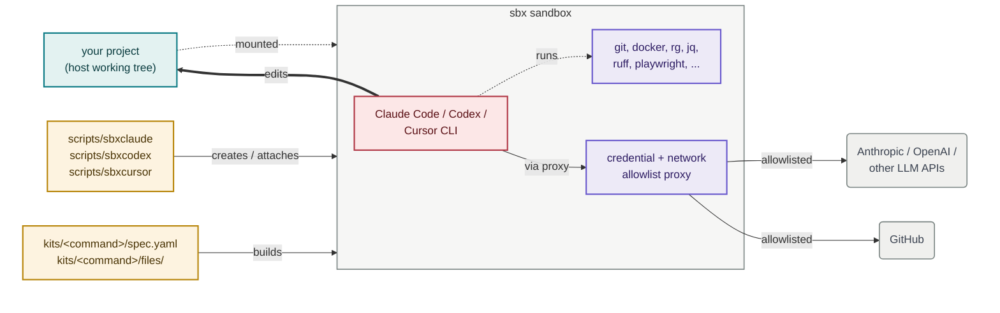

# sbxagent

[](https://github.com/lars20070/sbxagent/actions/workflows/ci.yml)
[](https://deepwiki.com/lars20070/sbxagent)
[](LICENSE)

`sbxagent` runs a coding agent in an isolated sandbox, with a fixed toolchain
already installed. Think of it as a customized version of
[`sbx run claude`](https://docs.docker.com/ai/sandboxes/agents/claude-code/), [`sbx run codex`](https://docs.docker.com/ai/sandboxes/agents/codex/) and [`sbx run cursor`](https://docs.docker.com/ai/sandboxes/agents/cursor/).

One script serves three commands — `sbxclaude`, `sbxcodex` and `sbxcursor` —
by dispatching on the name it was invoked as. Each gets its own sandbox and its
own credentials, so all three can run against the same project at once.

## How it works



<br>*The wrapper (amber) builds the sandbox from the matching kit spec and attaches to it. Inside, the agent (pink) uses the pinned toolchain (lavender) and talks out only through the credential and network-allowlist proxy, which lets through the agent's own LLM API and GitHub (grey) and blocks everything else. Your project (teal) is mounted straight into the sandbox and edited in place.*

## Supported agents

| Command | Agent | Parent kit | Entrypoint | Instruction file | MCP config | Network-block guard |
| --- | --- | --- | --- | --- | --- | --- |
| `sbxclaude` | Claude Code | `claude` | `claude` | `CLAUDE.md` | `~/.claude.json` | **yes** |
| `sbxcodex` | Codex | `codex` | `codex` | `AGENTS.md` | `~/.codex/config.toml` | yes (soft) |
| `sbxcursor` | Cursor | `cursor` | `agent` | `AGENTS.md` | `~/.cursor/mcp.json` | no |

The **network-block guard is not equally strong in each sandbox**, because the
three CLIs offer different hook outputs:

- `sbxclaude` **ends the turn**. Claude Code treats the guard's `continue:
  false` as a hard stop, registered as managed-settings hook JSON.
- `sbxcodex` **cannot force a stop**. The same guard runs as a managed
  `PostToolUse` hook, but Codex's documented behaviour for every hook output —
  `continue: false` and `decision: "block"` alike — is to replace the tool
  result and let the model continue. So the agent sees the blocked host and a
  firm instruction to stop, and the user sees how to lift the block, but
  nothing prevents the agent from carrying on.
- `sbxcursor` has **no guard**. Its post-execution hooks are observation-only
  and cannot even inject feedback. Its instructions still ask for a blocked host
  to be reported, with nothing enforcing it.

Both guards share one coverage gap: they match shell commands only, so a block
that surfaces solely in an MCP server's response is not caught.

`sbxcodex` is also the strictest sandbox in one respect: its admin-tier
`requirements.toml` sets `allow_managed_hooks_only`, so Codex ignores *all*
user, project, session and plugin hooks in there. That is deliberate — it stops
the guard being crowded out — but it is stricter than `sbxclaude`, which leaves
user hooks alone.

## What it does

Each sandbox gets:

- The agent itself, running with approvals bypassed inside the sandbox
- `jq`, `ripgrep`, `curl`, Python 3, and ShellCheck
- `ruff` and `yamllint` as Python development tools
- `markdownlint-cli2` and `cspell` for documentation checks
- Playwright, with headless Chromium, so the agent can load pages and
  screenshot UI changes itself
- mermaid-cli (`mmdc`), reusing that same Chromium, so the agent can render
  Mermaid diagrams to PNG/SVG from the terminal
- An `sbx` CLI for daemon-free kit commands (`version`, `kit validate`,
  `kit inspect`, `kit pack`) so `make validate` works inside the sandbox
- Passwordless `sudo`, and Docker, inside the sandbox
- A network allowlist, not open internet access
- `sbxclaude` and `sbxcodex`: a root-owned hook that catches a blocked request
  and prints the remedy that actually fits it — `sbx policy allow` for a
  default-deny, `sbx policy rm` for a local deny rule (deny beats allow, so
  allowing round it does nothing), or contact IT for an organisation policy the
  user cannot lift — ending the turn on `sbxclaude`, advising the agent to stop
  on `sbxcodex`
- Your project mounted as the workspace — edits land on your real files
- GitHub SSH remotes rewritten to HTTPS inside the sandbox, so `git fetch`
  works on the allowlisted port 443 without changing the host checkout
- Context7 and GitHub MCP servers, so the agent can pull current library docs
  and use GitHub's MCP tools regardless of the project's own MCP configuration

Each kit spec lives in `kits/<command>/spec.yaml`, and `scripts/sbxagent` is a
wrapper around the `sbx` CLI that builds (or re-attaches to) one sandbox per
project, named `<command>-<project_directory>-<hash>`. The hash comes from the
canonical absolute path, so same-named directories do not share a sandbox, and
the command name is the prefix, so the three agents never collide.

Sandbox size follows the host: every host CPU, and half the host memory capped
at 32 GiB. To pin a fixed size instead, uncomment the `resources:` block in
that kit's `spec.yaml` and rebuild.

## Install

You need macOS 14 or later on Apple silicon, or Linux on x86_64 or aarch64 with
KVM available. Docker Desktop is not required. Install the `sbx` CLI, sign in,
and link `scripts/sbxagent` onto your `PATH` once per agent you want.

[macOS:](https://docs.docker.com/ai/sandboxes/install/#install-on-macos)

```bash
brew trust docker/tap
brew install docker/tap/sbx
sbx login
```

[Linux:](https://docs.docker.com/ai/sandboxes/install/#linux)

```bash
curl -fsSL https://get.docker.com | sudo REPO_ONLY=1 sh
sudo apt-get install docker-sbx
sudo usermod -aG kvm "$USER" && newgrp kvm
sbx login
```

Then, on either platform:

```bash
ln -s /path_to_sbxagent_repo/scripts/sbxagent ~/.local/bin/sbxclaude
ln -s /path_to_sbxagent_repo/scripts/sbxagent ~/.local/bin/sbxcodex
ln -s /path_to_sbxagent_repo/scripts/sbxagent ~/.local/bin/sbxcursor
```

Link only the agents you want; each is independent. `sbxagent` deliberately has
no default agent — run it under its own name and it refuses, rather than
silently picking one for you.

## Use

Run the command for the agent you want, from any project directory:

```bash
sbxclaude     # or sbxcodex, or sbxcursor
```

The first run builds a sandbox for that directory and attaches to it. Later
runs re-attach to the same sandbox, so your work carries over.

To enter the sandbox with a Bash shell:

```bash
sbxclaude exec bash
```

### Commands

All three commands take the same signatures. `sbx<agent>` below is any of
`sbxclaude`, `sbxcodex` or `sbxcursor`.

| Command | Effect |
| --- | --- |
| `sbx<agent>` | Attach; create the sandbox first if missing |
| `sbx<agent> create` | Build the sandbox without attaching |
| `sbx<agent> rm` | Remove the sandbox after confirmation |
| `sbx<agent> name` | Print the derived sandbox name |
| `sbx<agent> version` | Print the kit name and version |
| `sbx<agent> exec CMD...` | Run a command inside the sandbox |
| `sbx<agent> inspect` | Show the sandbox's state |
| `sbx<agent> policy log` | Show the sandbox policy log |
| `sbx<agent> policy check HOST` | Check sandbox network access to `HOST` |
| `sbx<agent> kit validate` | Check the kit against the current schema |
| `sbx<agent> help` | Show usage |

The wrapper accepts only these signatures. It does not forward prompts or agent
flags. Use `sbx` and the name directly for anything outside the table. For
example

```bash
S="$(sbxclaude name)"
sbx inspect "${S}"
```

### Rebuild after kit changes

Remove and re-create the sandbox to apply changes to the kit:

```bash
sbxclaude rm   # confirms (y/N)
sbxclaude      # recreates from the kit and attaches
```

Pin bumps in `kits/*/spec.yaml` only take effect after this rebuild.

Codex signs itself in on first run and stores that login inside its sandbox, so
a `sbxcodex rm` costs you one sign-in on the next start. Claude and Cursor are
re-seeded automatically.

### Repo version

The repo version lives in `VERSION`, and `sbx<agent> version` prints it.
`make lint` fails if it disagrees with any kit `version:` or with
`CHANGELOG.md`'s latest release.

### Pinned toolchain versions

Directly installed tools are pinned so sandbox rebuilds and CI lint use the
same known versions. All three kits pin the same versions.

| Tool | Where pinned | Version |
| --- | --- | --- |
| `sbx` (in-sandbox) | `kits/*/spec.yaml` | `v0.39.0` (SHA-256 verified) |
| `ruff` | `kits/*/spec.yaml` | `0.16.2` |
| `yamllint` | `kits/*/spec.yaml` | `1.38.0` |
| `markdownlint-cli2` | `kits/*/spec.yaml`, CI | `0.23.2` |
| `cspell` | `kits/*/spec.yaml`, CI | `10.0.1` |
| `playwright` (+ Chromium) | `kits/*/spec.yaml` | `1.62.1` |
| `mermaid-cli` (`mmdc`) | `kits/*/spec.yaml` | `11.16.0` |
| Context7 MCP | `.mcp.json`, `.cursor/mcp.json`, `.vscode/mcp.json`, `kits/*/` MCP configs | `4.0.0` |
| `github-mcp-server` | `kits/*/spec.yaml` | `1.11.0` (SHA-256 verified) |

Intentional exceptions that stay on latest:

- CI `validate` installs the latest host `sbx` CLI so schema drift fails CI
  as soon as a new schema ships
- `extends: claude`, `extends: codex` and `extends: cursor`, the CI runner
  images, the packages those runners provide, and the host `sbx` install remain
  floating integration surfaces
- the host's own `github-mcp-server` comes from Homebrew and floats; only the
  in-sandbox copy is pinned, so the two can drift a version apart

To bump a pin: update the version (and sbx checksums) in **all three**
`kits/*/spec.yaml`, keep `tests/toolchain_test.sh` expectations in sync, then
rebuild the sandboxes and run `make lint`, `make test-unit`, `make validate`,
and `make test-toolchain AGENT=<agent>` for each.

### Git over HTTPS

Sandbox network policy allows `github.com:443` but not SSH port 22. Every kit
rewrites `git@github.com:` and `ssh://git@github.com/` remotes to
`https://github.com/` for the sandbox user only, so `git fetch` works without
changing the host checkout's remote URL.

Public repositories need no extra setup. For private repositories, store a
GitHub token on the host so the credential proxy can inject it:

```bash
echo "$(gh auth token)" | sbx secret set github
```

### GitHub MCP server

Every kit and this repo run [`github-mcp-server`](https://github.com/github/github-mcp-server)
locally over stdio. The definition has to agree across MCP configs, because the
sandbox mounts the project, so the repo's project-scope entry sits alongside the
kit's user-scope one and the agent warns about conflicting endpoints if the two
disagree. `make lint` enforces the Cursor pair.

Each agent reads the token differently, and the syntax is not interchangeable:

| Config | Form | Read by |
| --- | --- | --- |
| [`.mcp.json`](.mcp.json), [`.vscode/mcp.json`](.vscode/mcp.json), [`kits/sbxclaude/files/home/.claude.json`](kits/sbxclaude/files/home/.claude.json) | `"${GITHUB_TOKEN}"` | Claude Code |
| [`.cursor/mcp.json`](.cursor/mcp.json), [`kits/sbxcursor/files/home/.cursor/mcp.json`](kits/sbxcursor/files/home/.cursor/mcp.json) | `"${env:GITHUB_TOKEN}"` | Cursor |
| `~/.codex/config.toml`, written by `kits/sbxcodex/spec.yaml` | `env_vars = ["GITHUB_PERSONAL_ACCESS_TOKEN"]` | Codex |

Codex is the odd one out: its `env` table is a static map with no `${VAR}`
expansion, so the token is named rather than interpolated, and the entrypoint
exports it.

`GITHUB_TOKEN` means something different on each side, and that is what lets one
definition serve both:

| | `GITHUB_TOKEN` is | reaches GitHub as |
| --- | --- | --- |
| Host | your own PAT | itself |
| Sandbox | a proxy-managed sentinel, exported by the entrypoint | the real token, swapped in by the proxy |

So `sbx secret set github` above stays the only credential the sandbox needs,
and the real token never enters it.

The GitHub-hosted server at `https://api.githubcopilot.com/mcp/` is
deliberately **not** used. That endpoint is a Copilot endpoint and needs a
fine-grained PAT carrying the **Copilot Requests** permission; a token that
works fine for `git` and `gh` is rejected there with
`401 unauthorized: AuthenticateToken authentication failed`
(see [docker/sbx-releases#231](https://github.com/docker/sbx-releases/issues/231)).
Running the server locally sidesteps that, because it talks to the ordinary
REST API at `api.github.com`, which the credential proxy already authenticates.

#### Host setup

The sandbox installs the binary itself. On the host, install it once and export
your token:

```bash
brew install github-mcp-server          # Linux: see the project's releases page
export GITHUB_TOKEN="$(gh auth token)"  # or your own PAT, in your shell profile
```

If you previously stored a custom secret for the hosted Copilot endpoint, it is
now unused — retire it so it cannot shadow anything later:

```bash
sbx secret ls                      # find its placeholder
sbx secret rm --placeholder <the sbx-cs-… value>
```

Check it with `claude mcp list`, `codex mcp list` or `agent mcp list`;
the `github` line should report connected, both on the host and inside the
sandbox.
