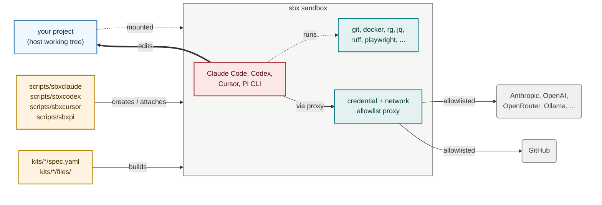

# sbxagent

[](https://github.com/lars20070/sbxagent/actions/workflows/ci.yml)
[](https://deepwiki.com/lars20070/sbxagent)
[](LICENSE)

`sbxagent` runs a coding agent in an isolated sandbox, with a fixed toolchain
already installed. Think of it as a customized version of
[`sbx run claude`](https://docs.docker.com/ai/sandboxes/agents/claude-code/), [`sbx run codex`](https://docs.docker.com/ai/sandboxes/agents/codex/) and [`sbx run cursor`](https://docs.docker.com/ai/sandboxes/agents/cursor/),
plus [Pi](https://pi.dev), which `sbx` ships no agent for at all.

One script serves four commands — `sbxclaude`, `sbxcodex`, `sbxcursor` and
`sbxpi` — by dispatching on the name it was invoked as. Each gets its own
sandbox and its own credentials, so all four can run against the same project
at once.

**Status: 0.4.0, pre-1.0.** The four commands and their signatures are settled;
kit internals and pinned tool versions move between releases.

## How it works



<br>*The wrapper (amber) builds the sandbox from the matching kit spec and attaches to it. Inside, the agent (pink) uses the pinned toolchain (lavender) and talks out only through the credential and network-allowlist proxy, which lets through the agent's own LLM API and GitHub (grey) and blocks everything else. Your project (teal) is mounted straight into the sandbox and edited in place.*

## Supported agents

| Command | Agent | Parent kit | Entrypoint | Instruction file | MCP config | Network-block guard |
| --- | --- | --- | --- | --- | --- | --- |
| `sbxclaude` | Claude Code | `claude` | `claude` | `CLAUDE.md` | `~/.claude.json` | **yes** |
| `sbxcodex` | Codex | `codex` | `codex` | `AGENTS.md` | `~/.codex/config.toml` | yes (soft) |
| `sbxcursor` | Cursor | `cursor` | `agent` | `AGENTS.md` | `~/.cursor/mcp.json` | no |
| `sbxpi` | Pi | *none* | `pi` | `AGENTS.md` | *none* | yes (overridable) |

`sbxpi` is the odd one out twice over. It has **no parent kit** — `sbx` ships
no Pi agent, so the kit builds on the bare `shell-docker` template and installs
everything itself. And Pi has **no MCP support at all**, so the kit lists no
MCP config; its model and provider settings live in
`~/.pi/agent/models.json` and `~/.pi/agent/settings.json` instead.

The **network-block guard is not equally strong in each sandbox**, because the
four CLIs offer different hook outputs. `sbxclaude` ends the turn, `sbxpi` ends
the run one tool call later, `sbxcodex` can only advise the agent to stop, and
`sbxcursor` has no guard at all. [docs/agents.md](docs/agents.md) gives the
reasoning, and the one coverage gap they all share.

## Install

You need macOS 14 or later on Apple silicon, or Linux on x86_64 or aarch64 with
KVM available. Docker Desktop is not required. Install the `sbx` CLI, sign in,
and link `scripts/sbxagent` onto your `PATH` once per agent you want.

[macOS:](https://docs.docker.com/ai/sandboxes/install/#install-on-macos)

```bash
brew trust docker/tap
brew install docker/tap/sbx
sbx login
```

[Linux:](https://docs.docker.com/ai/sandboxes/install/#linux)

```bash
curl -fsSL https://get.docker.com | sudo REPO_ONLY=1 sh
sudo apt-get install docker-sbx
sudo usermod -aG kvm "$USER" && newgrp kvm
sbx login
```

Then, on either platform:

```bash
ln -s /path_to_sbxagent_repo/scripts/sbxagent ~/.local/bin/sbxclaude
ln -s /path_to_sbxagent_repo/scripts/sbxagent ~/.local/bin/sbxcodex
ln -s /path_to_sbxagent_repo/scripts/sbxagent ~/.local/bin/sbxcursor
ln -s /path_to_sbxagent_repo/scripts/sbxagent ~/.local/bin/sbxpi
```

Link only the agents you want; each is independent. `sbxagent` deliberately has
no default agent — run it under its own name and it refuses, rather than
silently picking one for you.

## Quick start

Run the command for the agent you want, from any project directory:

```bash
sbxclaude     # or sbxcodex, sbxcursor, or sbxpi
```

The first run builds a sandbox for that directory and attaches to it. Later
runs re-attach to the same sandbox, so your work carries over.

To enter the sandbox with a Bash shell:

```bash
sbxclaude exec bash
```

## Commands

All four commands take the same signatures. `sbx<agent>` below is any of
`sbxclaude`, `sbxcodex`, `sbxcursor` or `sbxpi`.

| Command | Effect |
| --- | --- |
| `sbx<agent>` | Attach; create the sandbox first if missing |
| `sbx<agent> create` | Build the sandbox without attaching |
| `sbx<agent> rm` | Remove the sandbox after confirmation |
| `sbx<agent> name` | Print the derived sandbox name |
| `sbx<agent> version` | Print the kit name and version |
| `sbx<agent> exec CMD...` | Run a command inside the sandbox |
| `sbx<agent> inspect` | Show the sandbox's state |
| `sbx<agent> policy log` | Show the sandbox policy log |
| `sbx<agent> policy check HOST` | Check sandbox network access to `HOST` |
| `sbx<agent> kit validate` | Check the kit against the current schema |
| `sbx<agent> help` | Show usage |

The wrapper accepts only these signatures. It does not forward prompts or agent
flags. Use `sbx` and the name directly for anything outside the table. For
example

```bash
S="$(sbxclaude name)"
sbx inspect "${S}"
```

## Documentation

| Guide | Covers |
| --- | --- |
| [docs/agents.md](docs/agents.md) | How strictly each agent enforces a blocked request, and how each wires up the GitHub MCP server |
| [docs/toolchain.md](docs/toolchain.md) | What is installed in every sandbox, which versions are pinned, and how to rebuild after changing one |
| [docs/setup.md](docs/setup.md) | Host-side credentials: a GitHub token, an OpenRouter key, and optional local models through Ollama |
| [docs/published-kits.md](docs/published-kits.md) | Running a kit from the registry without cloning this repository |

## Support

Bugs and questions go to the
[issue tracker](https://github.com/lars20070/sbxagent/issues).

## License

MIT, copyright Lars Nilse. See [LICENSE](LICENSE).
