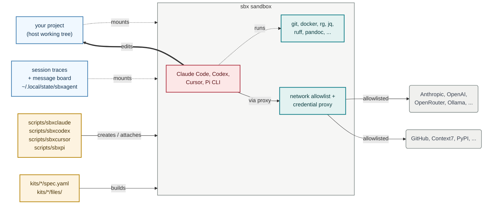

# sbxagent

[](https://github.com/lars20070/sbxagent/actions/workflows/ci.yml)
[](https://github.com/lars20070/sbxagent/releases/latest)
[](https://scorecard.dev/viewer/?uri=github.com/lars20070/sbxagent)
[](LICENSE)

`sbxagent` runs a coding agent in an isolated sandbox, with a fixed toolchain already installed. Think of it as a customized version of [`sbx run claude`](https://docs.docker.com/ai/sandboxes/agents/claude-code/), [`sbx run codex`](https://docs.docker.com/ai/sandboxes/agents/codex/) and so on.

A single script `sbxagent` serves four different commands — `sbxclaude`, `sbxcodex`, `sbxcursor` and `sbxpi` — by dispatching on the name it was invoked as. Each gets its own sandbox and its own credentials, so all four can run against the same project at once.



<br>*The wrapper (amber) builds the sandbox from the matching kit spec and attaches to it. Inside, the agent (red) runs pinned tools (teal) and talks out only through the credential and network-allowlist proxy, which lets through the agent's own LLM API and GitHub (grey) and blocks everything else. Your project (blue) is mounted straight into the sandbox and edited in place. A wrapper-managed host state folder (blue) is also mounted there, preserving each agent's native session traces and hosting a message board.*

## Contents

- [Quick start](#quick-start)
- [Install sbx](#install-sbx)
- [Commands](#commands)
- [Supported agents](#supported-agents)
- [Further documentation](#further-documentation)
- [Support](#support)
- [Security](#security)

<br>


## Quick start

There are two ways to start a sandbox. Both need `sbx` installed and signed in; see [details below](#install-sbx). `sbxcodex` below stands for any of the four agents: swap in `sbxclaude`, `sbxcursor` or `sbxpi`.

### (1) Run a published sandbox kit directly

```bash
sbx settings set kit.allowedSources '["docker.io/","ghcr.io/lars20070/"]'
sbx run ghcr.io/lars20070/sbxcodex:latest
```

Nothing to clone or install on the host. Run these two commands from the project directory you want the agent to work in. The first line runs once per host and allows `sbx` to load kits from this publisher. The second line builds a sandbox for the current directory and attaches to it. See [further details here](docs/published-kits.md).

### (2) Clone the repo and use the wrapper

```bash
git clone https://github.com/lars20070/sbxagent.git
ln -sf "$PWD/sbxagent/scripts/sbxagent" ~/.local/bin/sbxcodex
cd /path/to/your/project
sbxcodex
```

A little setup buys more convenience. Link `scripts/sbxagent` into a directory on your `PATH` (such as `~/.local/bin`) under the name of each agent you want, one link per agent. Then run that name from any project directory. The first run builds a sandbox for that directory and attaches to it. Later runs re-attach to the same sandbox, so your work carries over. `sbxagent` deliberately has no default agent — run it under its own name and it refuses, rather than silently picking one for you.

The wrapper adds what the published kit alone does not: one sandbox per project directory, re-attach, a host state folder that preserves each agent's session traces and hosts a message board, and the subcommands [discussed below](#commands). To enter the sandbox with a Bash shell:

```bash
sbxcodex exec bash
```

## Install sbx

You need macOS 14 or later on Apple silicon, or Linux on x86_64 or aarch64 with KVM available. Docker Desktop is not required. Install the `sbx` CLI and sign in.

> **sbx v0.45.0 is required.** sbx is experimental. A later version may break `sbxagent`.

[macOS:](https://docs.docker.com/ai/sandboxes/install/#install-on-macos)

```bash
brew trust docker/tap
brew install docker/tap/sbx
sbx login
```

[Linux:](https://docs.docker.com/ai/sandboxes/install/#linux)

```bash
curl -fsSL https://get.docker.com | sudo REPO_ONLY=1 sh
sudo apt-get install docker-sbx
sudo usermod -aG kvm "$USER" && newgrp kvm
sbx login
```

## Commands

All four commands take the same signatures. `sbx<agent>` below is any of `sbxclaude`, `sbxcodex`, `sbxcursor` or `sbxpi`.

| Command | Effect |
| --- | --- |
| `sbx<agent>` | Attach to the sandbox, creating it if missing |
| `sbx<agent> create` | Build the sandbox without attaching |
| `sbx<agent> rm` | Remove the sandbox after confirmation |
| `sbx<agent> name` | Print the derived sandbox name |
| `sbx<agent> version` | Print the kit name and version |
| `sbx<agent> exec CMD...` | Run a command inside the sandbox |
| `sbx<agent> inspect` | Show the sandbox's state |
| `sbx<agent> policy log` | Show the sandbox policy log |
| `sbx<agent> policy check HOST` | Check sandbox network access to `HOST` |
| `sbx<agent> kit validate` | Check the kit against the current schema |
| `sbx<agent> help` | Show usage |

The wrapper accepts only these signatures. It does not forward prompts or agent flags. Use `sbx` and the name directly for anything outside the table. For example:

```bash
S="$(sbxclaude name)"
sbx inspect "${S}"
```

None of this table applies to a sandbox started from a published kit; see [(1) above](#1-run-a-published-sandbox-kit-directly).

## Supported agents

| Agent | Command | Instruction file | MCP config | Network-block guard |
| --- | --- | --- | --- | --- |
| Claude Code | `sbxclaude` | `CLAUDE.md` | `~/.claude.json` | yes |
| Codex | `sbxcodex` | `AGENTS.md` | `~/.codex/config.toml` | yes |
| Cursor | `sbxcursor` | `AGENTS.md` | `~/.cursor/mcp.json` | no |
| Pi | `sbxpi` | `AGENTS.md` | none | yes |

`sbxpi` is the odd one out twice over. It has **no parent kit** — `sbx` ships no Pi agent, so the kit builds on the bare `shell-docker` template and installs everything itself. And Pi has **no MCP support at all**, so the kit lists no MCP config; its model and provider settings live in `~/.pi/agent/models.json` and `~/.pi/agent/settings.json` instead.

A `yes` means a guard runs, not that it cannot be escaped. [docs/agents.md](docs/agents.md) says how strong each one is, why the four CLIs differ, and what every guard misses.

The wrapper also preserves each agent's native session traces in its per-project state folder, where sibling agents can read them by default, and mounts a per-project message board every agent's sandbox can write to. [docs/traces.md](docs/traces.md) and [docs/messageboard.md](docs/messageboard.md) list the paths and the create-time privacy setting they share.

## Further documentation

| Guide | Covers |
| --- | --- |
| [Host setup](docs/setup.md) | Host-side credentials: a GitHub token, an OpenRouter key, and optional local models through Ollama |
| [Toolchain](docs/toolchain.md) | What is installed in every sandbox, which versions are pinned, and how to rebuild after changing one |
| [Session traces](docs/traces.md) | Where each agent's session traces are kept, which sibling agents can read them, and how long they last |
| [Message board](docs/messageboard.md) | The shared per-project folder every agent's sandbox can write to, and how to turn it off |
| [Agent differences](docs/agents.md) | How strictly each agent enforces a blocked request, and how each wires up the GitHub MCP server |
| [Published kits](docs/published-kits.md) | Running a kit from the registry without cloning this repository |

## Support

Bugs and questions go to the [issue tracker](https://github.com/lars20070/sbxagent/issues).

## Security

See [SECURITY.md](SECURITY.md) for the threat model, how to report a vulnerability, and how to verify what you run.
