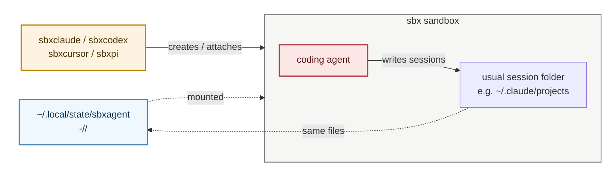

# Session traces

Where each agent's session trace ends up, and who else can read it. See
[toolchain.md](toolchain.md) for the state folder these paths sit in.

## Contents

- [How traces reach the host](#how-traces-reach-the-host)
- [Where the traces live](#where-the-traces-live)
- [Trace formats](#trace-formats)
- [Cross-sandbox visibility](#cross-sandbox-visibility)
- [Retention and exceptions](#retention-and-exceptions)

## How traces reach the host

Each agent still writes its sessions in the usual place inside the sandbox.
The wrapper also mounts a per-project folder on the host under
`~/.local/state/sbxagent/<slug>-<hash>/<agent>/` (for example
`…/sbxclaude/`, `…/sbxcodex/`, `…/sbxcursor/`, or `…/sbxpi/`).

Those two views are the same files. When the agent saves a session, it shows
up on the host right away — there is no later copy or sync step.

 *The wrapper (amber) creates the sandbox and mounts the host state folder
(blue) into it. The agent (red) keeps writing to its usual session path; that
path and the host folder show the same files.*

## Where the traces live

The wrapper keeps each agent's native session format and relocates its trace
tree into that agent's state subfolder:

| Agent | Stock path in the sandbox | Path below the agent state folder |
| --- | --- | --- |
| Claude Code | `~/.claude/projects` | `projects/` |
| Codex | `~/.codex/sessions` | `sessions/` |
| Cursor | `~/.cursor/projects` | `projects/` |
| Pi | `~/.pi/agent/sessions` | `sessions/` |

## Trace formats

Each agent owns its own on-disk format; the wrapper only keeps those files on
the host. Layouts can change with agent releases. Roughly, under each agent's
state subfolder:

| Agent | Typical path under the agent state folder | What you find |
| --- | --- | --- |
| Claude Code | `projects/-<escaped-cwd>/<session-uuid>.jsonl` | One JSONL file per session; each line is a typed event (`user`, `assistant`, and similar) |
| Codex | `sessions/<YYYY>/<MM>/<DD>/rollout-<timestamp>-<id>.jsonl` | Date-bucketed “rollout” JSONL files |
| Cursor | `projects/<escaped-cwd>/agent-transcripts/<id>/<id>.jsonl` | Per-chat transcript JSONL (`role` user/assistant). Other project files (for example `mcp-approvals.json`) may sit alongside |
| Pi | `sessions/--<escaped-cwd>--/<timestamp>_<id>.jsonl` | One JSONL per session; a `session` header line, then messages and events |

## Cross-sandbox visibility

With the default `CROSS_SANDBOX_VISIBILITY=true`, sibling agents for the same
project can read these complete traces, including prompts, tool output, file
excerpts, and any secrets recorded in them. Set
`CROSS_SANDBOX_VISIBILITY=false` before creating a sandbox to hide sibling
state. This setting, and whether traces are relocated at all, are fixed at
sandbox creation time; remove and rebuild existing sandboxes after changing the
setting or upgrading to a kit that supports traces.

## Retention and exceptions

Claude Code applies its normal `cleanupPeriodDays` retention setting (30 days
by default) to these host-backed transcripts. Cursor's SQLite resume store
remains inside its sandbox to avoid database locking on the shared mount. A kit
started directly with `sbx run`, without the wrapper-provided
`SBXAGENT_STATE_DIR`, keeps its stock trace location.
