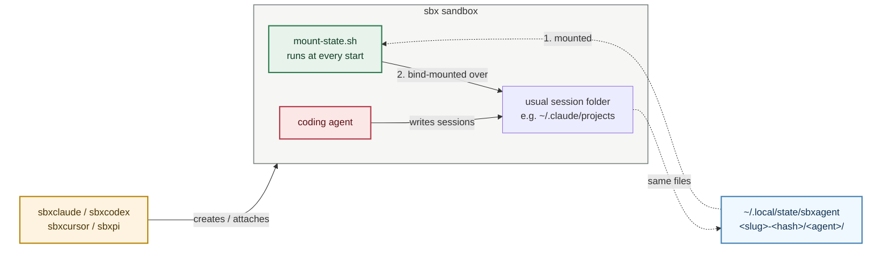

# Session traces

Where each agent's session trace ends up, and who else can read it. See
[toolchain.md](toolchain.md) for the state folder these paths sit in.

## Contents

- [How traces reach the host](#how-traces-reach-the-host)
- [Where the traces live](#where-the-traces-live)
- [Trace formats](#trace-formats)
- [Cross-sandbox visibility](#cross-sandbox-visibility)
- [Retention and exceptions](#retention-and-exceptions)
- [Under the hood](#under-the-hood)

## How traces reach the host

Each agent saves its sessions where it always does, inside the sandbox. The
wrapper makes that folder and a folder on your machine the same folder. The
host folder is `~/.local/state/sbxagent/<slug>-<hash>/<agent>/`, for example
`…/sbxclaude/`.

So when the agent saves a session, the file is on your machine at once. Nothing
copies or syncs it later.

It works in two steps:

1. The wrapper mounts the host folder into the sandbox.
2. Inside, a small script mounts that folder over the agent's own session
   folder. Whatever the agent writes there lands on the host.

Step 2 is a bind mount. Think of it as one folder with two doors. It does not
survive a restart, so the sandbox redoes it every time it starts. It is safe to
redo: if the two folders are already the same, the script does nothing.



<br>*The wrapper (amber) creates the sandbox and mounts the host state folder
(blue) into it. At every start, a script (green) mounts that folder over the
agent's usual session path. The agent (red) keeps writing there, and the files
show up on the host. See [Under the hood](#under-the-hood) for the details.*

## Where the traces live

Everything sits under one folder in your home directory:

```text
~/.local/state/sbxagent/<slug>-<hash>/<agent>/
```

- `<slug>` is the name of your project folder. Anything that is not a letter,
  digit or dash becomes a dash.
- `<hash>` is the first 8 characters of a SHA-256 of the project's full path.
  Two projects with the same folder name still get different state folders.
- `<agent>` is the wrapper you ran: `sbxclaude`, `sbxcodex`, `sbxcursor` or
  `sbxpi`.

Say your project is `~/Code/weather-app` and you have used all four agents on
it. Your home folder then looks like this:

```text
~
├── Code
│   └── weather-app                      ← your project
└── .local
    └── state
        └── sbxagent
            └── weather-app-3f9a1c2e     ← <slug>-<hash>
                ├── sbxclaude
                │   └── projects
                │       └── -Users-you-Code-weather-app
                │           └── 8c1d2e7a-….jsonl
                ├── sbxcodex
                │   └── sessions
                │       └── 2026
                │           └── 09
                │               └── 13
                │                   └── rollout-2026-09-13T10-42-07-….jsonl
                ├── sbxcursor
                │   └── projects
                │       └── Users-you-Code-weather-app
                │           └── agent-transcripts
                │               └── 5b7e…
                │                   └── 5b7e….jsonl
                └── sbxpi
                    └── sessions
                        └── --Users-you-Code-weather-app--
                            └── 2026-09-13T10-42-07_….jsonl
```

You do not have to work any of that out. In your project, run `sbxclaude name`
(or the matching command for the other agents). It prints
`sbxclaude-<slug>-<hash>`. Drop the `sbxclaude-` prefix and you have the folder:

```bash
cd ~/.local/state/sbxagent/"$(sbxclaude name | sed 's/^sbxclaude-//')"/sbxclaude
```

If you set `XDG_STATE_HOME`, the tree lives under `$XDG_STATE_HOME/sbxagent/`
instead of `~/.local/state/sbxagent/`.

The wrapper keeps each agent's native session format and relocates its trace
tree into that agent's state subfolder:

| Agent | Stock path in the sandbox | Path below the agent state folder |
| --- | --- | --- |
| Claude Code | `~/.claude/projects` | `projects/` |
| Codex | `~/.codex/sessions` | `sessions/` |
| Cursor | `~/.cursor/projects` | `projects/` |
| Pi | `~/.pi/agent/sessions` | `sessions/` |

## Trace formats

Each agent owns its own on-disk format; the wrapper only keeps those files on
the host. Layouts can change with agent releases. Roughly, under each agent's
state subfolder:

| Agent | Typical path under the agent state folder | What you find |
| --- | --- | --- |
| Claude Code | `projects/-<escaped-cwd>/<session-uuid>.jsonl` | One JSONL file per session; each line is a typed event (`user`, `assistant`, and similar) |
| Codex | `sessions/<YYYY>/<MM>/<DD>/rollout-<timestamp>-<id>.jsonl` | Date-bucketed “rollout” JSONL files |
| Cursor | `projects/<escaped-cwd>/agent-transcripts/<id>/<id>.jsonl` | Per-chat transcript JSONL (`role` user/assistant). Other project files (for example `mcp-approvals.json`) may sit alongside |
| Pi | `sessions/--<escaped-cwd>--/<timestamp>_<id>.jsonl` | One JSONL per session; a `session` header line, then messages and events |

## Cross-sandbox visibility

With the default `CROSS_SANDBOX_VISIBILITY=true`, sibling agents for the same
project can read these complete traces, including prompts, tool output, file
excerpts, and any secrets recorded in them. Set
`CROSS_SANDBOX_VISIBILITY=false` before creating a sandbox to hide sibling
state. This setting, and whether traces are relocated at all, are fixed at
sandbox creation time; remove and rebuild existing sandboxes after changing the
setting or upgrading to a kit that supports traces.

## Retention and exceptions

Claude Code applies its normal `cleanupPeriodDays` retention setting (30 days
by default) to these host-backed transcripts. Cursor's SQLite resume store
remains inside its sandbox to avoid database locking on the shared mount. A kit
started directly with `sbx run`, without the wrapper-provided
`SBXAGENT_STATE_DIR`, keeps its stock trace location.

## Under the hood

For readers who want the details. The rest of this page does not depend on
them.

### The wrapper's side

`scripts/sbxagent` works out the per-agent state folder (`AGENT_DIR`), creates
it with mode `0700`, and hands it to `sbx` twice:

```bash
sbx run --name "${SANDBOX}" -e "SBXAGENT_STATE_DIR=${AGENT_DIR}" "${KIT}" . "${AGENT_DIR}"
```

The last operand mounts the folder read-write at the same absolute path inside
the sandbox. The `-e` flag tells the kit where it is. Without
`SBXAGENT_STATE_DIR`, as with a kit started by plain `sbx run`, nothing below
runs and the agent keeps its stock trace location.

### The kit's side

Inside the sandbox, `~/.local/lib/sbxagent/mount-state.sh LINK SUBDIR` mounts
`${SBXAGENT_STATE_DIR}/SUBDIR` (call it `TARGET`) over the agent's stock trace
folder (`LINK`, for example `~/.claude/projects`). It runs as the `agent`
user, and:

1. Exits `0` at once if `SBXAGENT_STATE_DIR` is unset.
2. Exits `2` if `LINK` is a symlink. That is a sandbox left over from the old
   symlink design; remove and recreate it.
3. Runs `mkdir -p` on both `TARGET` and `LINK`. `mount --bind` needs an
   existing destination and will not create one, and the pi kit never creates
   `~/.pi/agent/sessions` itself.
4. Compares the `stat` device and inode of `LINK` and `TARGET`. If they match,
   the mount is already in place and the script exits `0`. This is the only
   "already done" check. A marker file under `SBXAGENT_STATE_DIR` would live on
   the host, outlive `sbx rm`, and make a rebuilt sandbox skip the next step.
5. Seeds `TARGET` from `LINK`: every entry in `LINK` whose name is missing from
   `TARGET` is copied over with `cp -R`. Host files win; the script never
   overwrites one. It skips `lost+found`. This single loop handles both the
   first migration and the files a rebuilt sandbox's parent kit has just
   seeded.
6. Runs `sudo -n mount --bind TARGET LINK`. From now on, writing to `LINK`
   writes to `TARGET`, which is the host folder.

Any failure after step 1 exits `1`. The entrypoint then refuses to start the
agent: traces written to an unbound `LINK` live only inside the sandbox and die
with it.

### Two call sites

A bind mount lives in the kernel's mount table, not on disk, so every stop
drops it. Each kit calls `mount-state.sh` from two places, and needs both:

- A `setup.startup` step, which the runtime runs at every start. It covers
  sessions that never launch the agent, such as `sbxclaude exec bash`.
- The `sandbox.entrypoint` wrapper, which runs the script just before
  `exec claude "$@"` (or `codex`, `cursor-agent`, `pi`). It covers the starts
  where a startup step is known not to run: after a daemon restart
  (docker/sbx-releases #420) and when `sbx exec` wakes a stopped sandbox
  (#479).

Whichever runs first does the work. The other hits the match in step 4 and
exits `0`.

### Why a bind mount, not a symlink

An earlier version replaced `LINK` with a symlink to `TARGET`. That broke every
start after the first. The parent `claude` kit provisions `~/.claude/projects`
as its own persistent volume, the runtime recreates that mount destination at
each start, and it refuses to do so through a symlink. All the user saw was
`failed to start runtime: 500 Internal Server Error`. Keeping `LINK` a real
directory keeps it a valid mount destination for the life of the sandbox. The
price is the re-mount on every boot described above.
