# Supervising Codex with Claude in `sbxagent`

## Summary

Claude can observe Codex's changes when `sbxcodex` and `sbxclaude` use the
same host project directory, but only through the shared workspace. The two
agents remain in separate microVMs.

Claude cannot directly observe Codex's conversation, terminal, tool calls,
processes, private sandbox filesystem, nested Docker daemon, or complete
network activity. It also cannot reliably stop Codex from inside its own
sandbox.

Consequently, this arrangement can provide live review, but it is not by
itself a security boundary. Strong supervision requires enforcement and
promotion to happen outside Codex's writable trust boundary, preferably in a
host-side coordinator.

## Current sandbox behavior

Docker Sandboxes mounts a workspace using direct filesystem passthrough. If
both sandboxes mount the same host directory, changes are visible immediately
to the host and both agents without a synchronization step.

The remainder of each sandbox is isolated:

- Each agent has its own microVM, processes, filesystem, Docker daemon, and
  network.
- Sandbox-local packages, agent state, and histories are not shared.
- `sbx policy log <sandbox>` is a host-side facility and records network
  traffic only.
- `sbx exec` can inspect a running sandbox from the host.
- Sandbox management requires the host `sbx` CLI and `sandboxd`; an agent
  inside another sandbox cannot manage the Codex sandbox.

This agrees with the repository implementation. The wrapper derives sandbox
names from the command, project directory, and canonical-path hash. Therefore,
`sbxcodex` and `sbxclaude` deliberately create distinct sandboxes even when
invoked from the same directory.

## Passive review using the same working tree

Claude can be instructed to remain read-only and repeatedly inspect Codex's
changes with commands such as:

```bash
git status --short
git diff --stat
git diff
git diff --cached
git ls-files --others --exclude-standard
```

A suitable instruction is:

> Act only as a security reviewer. Do not modify files. Periodically inspect
> the working-tree diff, newly created files, dependency changes, executable
> files, CI configuration, credential handling, network-facing code, and
> shell commands committed to scripts. Report suspicious changes and wait for
> instructions.

This mode has important limitations:

- Codex and Claude can race over the same files and Git index.
- Claude cannot reliably attribute a change to Codex rather than the user.
- Codex could create, use, and remove a file between Claude's reviews.
- Codex could modify reviewer instructions stored in the shared project.
- Claude cannot prevent or reliably reverse an operation.
- Both agents currently run with their normal approval checks bypassed.
- Codex's managed network-block hook observes results after a tool call and is
  a soft stop rather than a hard enforcement mechanism.

This is useful as a second pair of eyes, but should not be described as an
authoritative security supervisor.

## Recommended architecture: propose, review, promote

Keep Codex away from the authoritative checkout and review immutable units of
work:

```mermaid
flowchart LR
  subgraph CODEX_VM["Codex sandbox"]
    CODEX["Codex<br/>coding agent"]
  end

  subgraph HOST["Host-controlled workflow"]
    direction LR
    WORK["xyz-codex/<br/>mutable worktree"]
    SNAP["immutable patch<br/>+ content digest"]
    GATE["deterministic<br/>policy gates"]
    PROMOTE["explicit promotion<br/>of reviewed digest"]
    MAIN["xyz/<br/>authoritative checkout"]
  end

  subgraph CLAUDE_VM["Claude sandbox"]
    CLAUDE["Claude<br/>security reviewer"]
    REPORT["approve/reject report<br/>+ reviewed digest"]
  end

  CODEX ==>|"edits"| WORK
  WORK -->|"host snapshots"| SNAP
  SNAP -.->|"read-only review input"| CLAUDE
  CLAUDE --> REPORT
  SNAP --> GATE
  REPORT --> GATE
  GATE -->|"approved digest only"| PROMOTE
  PROMOTE ==> MAIN

  classDef data    fill:aliceblue,stroke:steelblue,stroke-width:2px,color:#10314F
  classDef host    fill:#FDF3E0,stroke:#B8860B,stroke-width:2px,color:#4A3405
  classDef helper  fill:#E3F2F1,stroke:#0E7C86,stroke-width:2px,color:#0B3D40
  classDef agent   fill:#FCE7E7,stroke:#B23A48,stroke-width:2px,color:#5A1015
  classDef ext     fill:#F0F0EE,stroke:#7A8482,stroke-width:1.5px,color:#3A4250
  class WORK,SNAP,MAIN data
  class PROMOTE host
  class GATE helper
  class CODEX,CLAUDE agent
  class REPORT ext
  style CODEX_VM fill:#F6F6F5,stroke:#7A8482,stroke-width:1.5px
  style CLAUDE_VM fill:#F6F6F5,stroke:#7A8482,stroke-width:1.5px
  style HOST fill:none,stroke:none
```



Use separate locations, for example:

```text
xyz/                 # Authoritative checkout
xyz-codex/           # Codex working tree
xyz-audit/           # Host-owned diffs, events, and review decisions
```

A Git worktree is generally more convenient than another clone:

```bash
git -C xyz worktree add ../xyz-codex -b codex/work
```

Run `sbxcodex` from `xyz-codex/`. Claude should review a stable patch or commit
produced from that worktree. Only a host-side coordinator should apply an
approved patch or merge an approved commit into `xyz/`.

Claude supplies security judgment, while deterministic host checks enforce
policy. Suggested gates include:

- Reject changes outside an explicit path allowlist.
- Reject symlinks, device files, unexpected executables, and oversized
  binaries.
- Flag changes to dependency manifests, lockfiles, CI configuration, hooks,
  build scripts, Dockerfiles, and agent instructions.
- Run linting, tests, secret scanning, dependency auditing, and static
  analysis.
- Require structured approval tied to the reviewed commit ID or patch digest.
- Recalculate that identity immediately before promotion to prevent a
  review/use race.
- Apply an immutable patch or commit instead of copying a mutable directory.

## Real-time telemetry

The Codex kit already installs a root-owned managed `PostToolUse` hook. It
could also emit a JSON event after each tool call, containing fields such as:

```json
{
  "sequence": 42,
  "session": "...",
  "time": "...",
  "tool": "Bash",
  "working_directory": "...",
  "input_digest": "...",
  "result_digest": "...",
  "git_head": "...",
  "worktree_digest": "..."
}
```

Claude could correlate those events with filesystem snapshots and diffs.
Events stored in the shared worktree are not trustworthy, however, because
Codex can modify the same mount.

For security-grade telemetry:

1. Run an audit receiver outside the Codex microVM.
2. Specifically allow its endpoint in the Codex network policy.
3. Authenticate events and store them append-only or in a hash chain.
4. Snapshot the host worktree independently of Codex.
5. Give Claude a read-only view of the event log and snapshots.

This requires a host-side component. The Claude sandbox cannot itself manage
or inspect all state belonging to the Codex sandbox.

## Controls independent of Claude

The sandbox and host should enforce critical controls regardless of Claude's
assessment:

- Do not give Codex production, deployment, signing, or cloud-administration
  credentials.
- Prefer read-only or narrowly scoped GitHub credentials.
- Treat network allow/deny policy as the actual egress boundary.
- Deny network access entirely for tasks that do not require it.
- Keep sensitive paths outside the mounted workspace.
- Never mount SSH configuration, password stores, cloud credentials, or the
  host Docker socket.
- Use server-side protected branches to prevent direct pushes.
- Require CI and human approval for security-sensitive changes.
- Apply resource and runtime limits and retain a host-side termination path.

`sbxagent` already provides useful foundations: distinct microVMs, separate
credentials, network allowlists, and proxy-managed secrets. Claude should
augment these controls rather than replace them.

## Proposed `sbxagent` changes

Supervision should be implemented as a host workflow rather than by placing
both agents in one sandbox or allowing them to edit the authoritative checkout
simultaneously.

A future `sbxreview` or `sbxsupervise` command could:

1. Create or select a dedicated Codex worktree.
2. Start Codex with reduced credentials and optional network denies.
3. Periodically capture the diff and untracked files into a host-controlled
   audit directory.
4. Start Claude with immutable snapshots to review.
5. Ask Claude for machine-readable findings and the reviewed-content digest.
6. Run deterministic policy checks.
7. Offer an explicit host-side `promote <digest>` operation.
8. Store sandbox inspection data and the Codex network-policy log with each
   review.
9. Provide host-side `stop` and `quarantine` operations. Quarantine should
   block promotion and preserve evidence rather than ask Claude to repair the
   suspect tree.

Using two agents concurrently on exactly the same `xyz/` directory can remain
an informal pair-review mode. For meaningful security supervision, Codex's
mutable work area should be separated from the authoritative checkout, and a
host-side promotion gate should remain the final authority.

## References

- Docker documentation, *Sandboxes architecture*: workspace mounting,
  microVM isolation, persistence, and lifecycle.
- Docker documentation, *Get started with Docker Sandboxes*: mounted
  workspace visibility and sandbox listing.
- Docker documentation, *Docker Sandboxes usage*: `sbx exec` and clone mode.
- Docker documentation, *Monitoring*: `sbx policy log` records network
  traffic and can be filtered by sandbox.
- `README.md`: shared host workspace and independent agent sandboxes.
- `scripts/sbxagent`: per-command, per-project sandbox naming and lifecycle.
- `docs/toolchain.md`: mounted workspaces, isolated agents, and bypassed agent
  approvals.
- `docs/agents.md`: strengths and limitations of the managed network guards.
