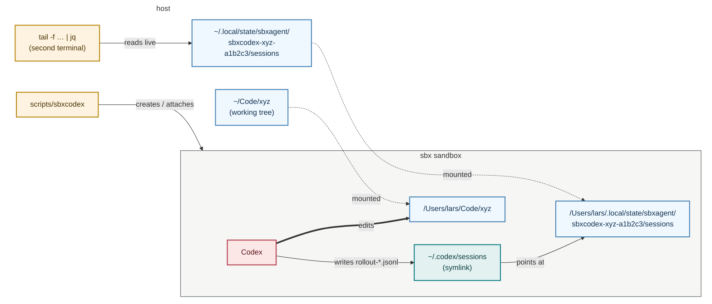

# Watching Codex traces from the host

Two mounts work today, and there is a clean way to point Codex's trace folder
at the second one.

## Where the traces live

```text
${XDG_STATE_HOME:-$HOME/.local/state}/sbxagent/<sandbox-name>/sessions
```

For the repo at `/Users/lars/Code/xyz` that is

```text
~/.local/state/sbxagent/sbxcodex-xyz-a1b2c3/sessions/2026/09/11/rollout-….jsonl
```

Session logs are state: the XDG spec reserves `$XDG_STATE_HOME` for "logs,
history, recently used files", with `~/.local/state` as the default. It works
unchanged on macOS and Linux, and no other tool mistakes it for a repo.

The folder is keyed on the **sandbox name**, not the repo name. `sbxcodex name`
already yields a unique slug plus hash per directory, so two `xyz` checkouts
get two folders, and `sbxcodex rm` can find the matching traces later.

In the wrapper this is one line, bash 3.2 safe:

```bash
TRACES="${XDG_STATE_HOME:-${HOME}/.local/state}/sbxagent/${SANDBOX}/sessions"
```

## The two building blocks

**1. `sbx` takes more than one path.** `sbx create KIT PATH...` — the first
path is the workspace, the rest are extra mounts. Each host folder shows up
**at the same absolute path** inside the sandbox, so the traces folder has the
same path on both sides. (Add `:ro` for read-only; not wanted here.)

**2. Codex cannot move just its `sessions` folder.** Only `CODEX_HOME` moves,
and that drags `config.toml` and `auth.json` with it — the parent kit seeds
those, so leave it alone. The trick is a symlink instead:

```text
~/.codex/sessions  →  ~/.local/state/sbxagent/<sandbox-name>/sessions
```

Codex writes through it, and the file appears on the host as it is written.

## The setup



<br>*Two host folders (blue) are mounted into the sandbox at the same absolute paths. Codex (red) edits the project as usual and writes every session log through the `~/.codex/sessions` symlink (teal), so each line lands under `~/.local/state/sbxagent/` on the host as it is written. The wrapper (amber) creates and attaches; a second terminal (amber) tails the log.*

## Ways to wire it

| Option | How | Verdict |
| --- | --- | --- |
| **A. By hand, today** | Create the sandbox once with `sbx create` and both paths, then make the symlink. No code change. | Try this first |
| **B. Bake it in** | Wrapper derives the path, `mkdir -p`s it, mounts it, and passes `-e SBXCODEX_TRACES=<path>`; the kit's entrypoint makes the symlink if that dir exists. | Do this once A works |
| C. Folder in the repo | `<repo>/.codex-sessions`, gitignored, no second mount | Traces land in the tree and the agent can read its own. Skip |
| D. `CODEX_ROLLOUT_TRACE_ROOT` | Env var, no symlink needed | Writes debug bundles, not the session log. Different thing |
| E. `.sbxenv.yaml` `additionalWorkspaces` | Declarative | Wrapper ignores it, and upstream #564 says it broke in 0.42. Skip |

## Option A, step by step

On the host, in the project:

```bash
TRACES="${XDG_STATE_HOME:-${HOME}/.local/state}/sbxagent/$(sbxcodex name)/sessions"
mkdir -p "$TRACES"
sbx create --name "$(sbxcodex name)" /path_to_sbxagent_repo/kits/sbxcodex . "$TRACES"
sbxcodex exec ln -sfn "$TRACES" /home/agent/.codex/sessions
sbxcodex
```

Then in a second terminal on the host:

```bash
tail -f "$TRACES/$(date +%Y/%m/%d)"/rollout-*.jsonl | jq -c '.type'
```

`sbxcodex` after that just re-attaches; the extra mount and symlink stick
until `sbxcodex rm`.

## Two things to know

- **`codex resume` and listing work through the symlink.** Archiving a session
  (`archived_sessions`) may fail with "cross-device link", because it renames
  across the mount. Harmless.
- **The wrapper hard-codes one path** (`scripts/sbxagent:171` and `:136`).
  That is why A bypasses it for the create step. B fixes that properly.

## What the trace holds

One JSON line per event in
`sessions/YYYY/MM/DD/rollout-<timestamp>-<uuid>.jsonl`: prompts, agent
messages, every tool call with its arguments, every tool result, file patches,
MCP calls, and `reasoning` items.

The `reasoning` items are the **summary** Codex shows on screen. OpenAI never
hands out the raw chain of thought — the API returns it only as an encrypted
blob — so no tool can log more than that.
